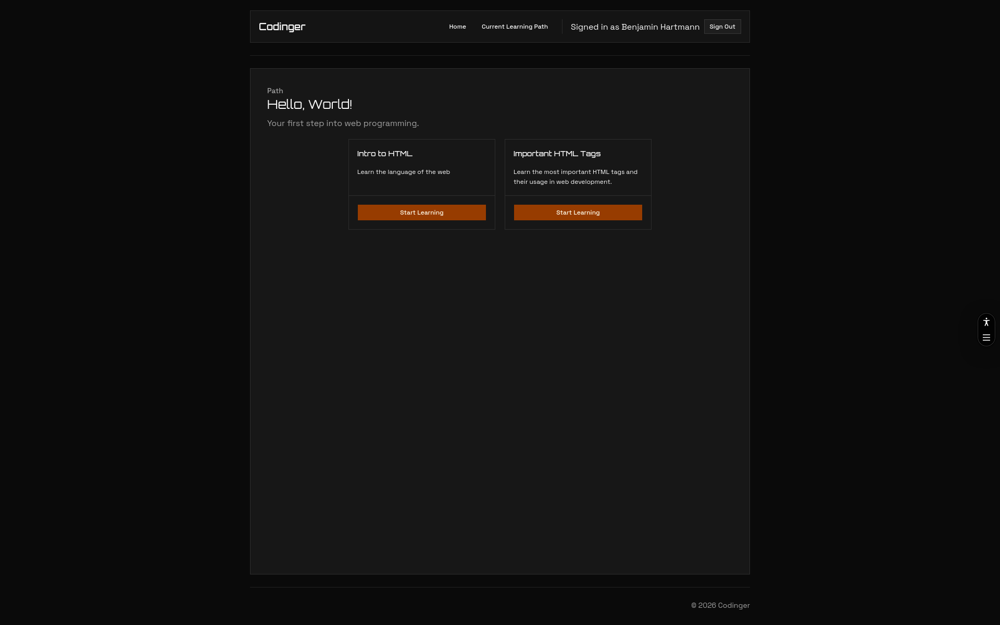

# Codinger

A platform to learn to code by completing interactive coding exercises.

This is a work in progress.

## Tech Stack

* Next.js
* TypeScript
* Tailwind CSS
* Shadcn/ui
* Prisma ORM
* PostgreSQL (sqlite for development)

## Motivation

I see my peers struggle to keep up with the fast-paced programming lessions at school. I want to create a web app to help them with learn to code web programming languages (Planend are: HTML, CSS, JavaScript, TypeScript, React).

Apart from that, I need hours for Hack Club Horizons AND I aways wanted to try Tailwind CSS and Shadcn/ui, so this is a perfect opportunity to do so.

## How it works

TODO: Add "How it works" section

## Work in progress

* Add more courses / content
* Add password reset functionality
* Add a way for users to change their account settings (email, password, etc.)

## License Attribution

Used code that is Copyright (c) Microsoft Corporation. All rights reserved. under the MIT License. Licensed under the MIT License.

## AI use

* I am using models from OpenAI and CLaude to aid in repetetive tasks (coding)
* The README is fully self-written
